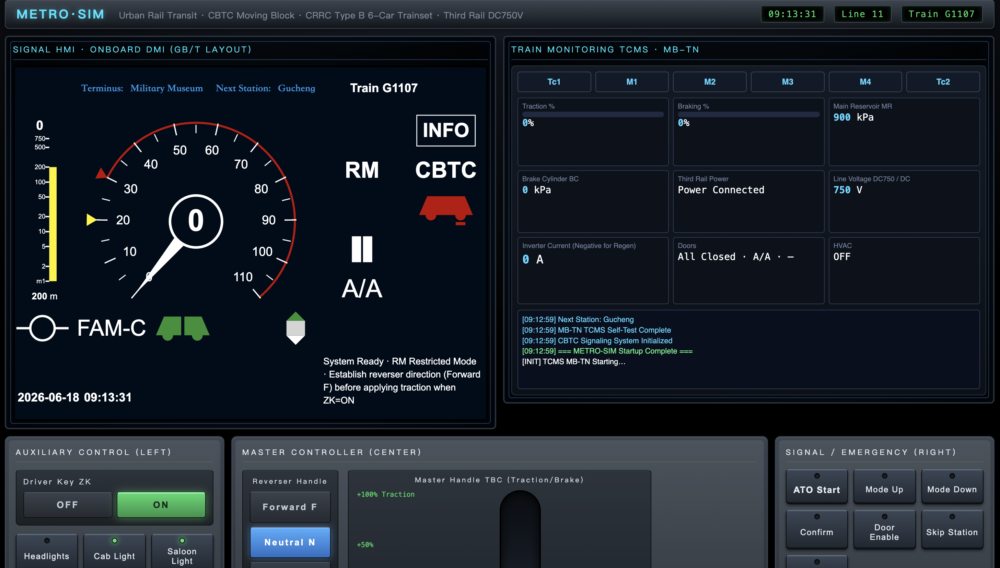
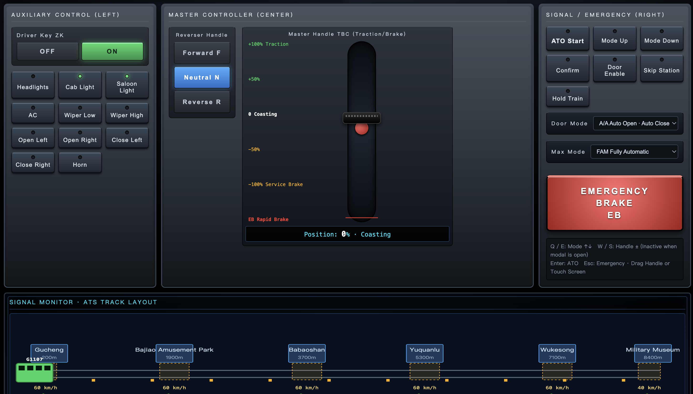
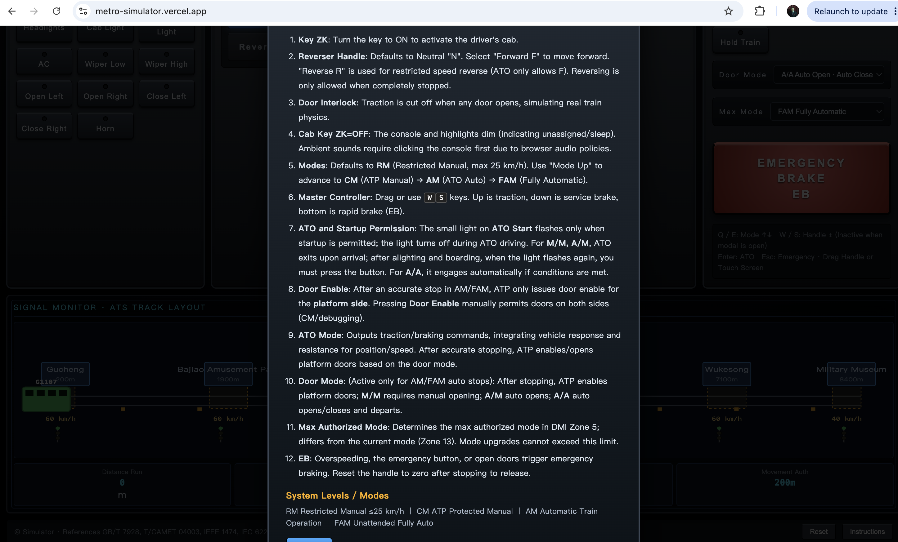

# China Metro Train Driving Simulator / Metro Driver Simulator

A browser-based simulator that highly restores a Chinese urban rail transit driver's cab, developed with reference to:

- Signaling System: **Traffic Control Technology (TCT) CBTC** Moving Block, referencing *T/CAMET 04003*, *IEEE 1474*, and *IEC 62267*.
- Rolling Stock: **CRRC Type B Train** in a 6-car configuration (Tc-M-M-M-M-Tc), powered by a **DC 750V third rail** via collector shoes.
- Train Control and Monitoring System (TCMS): Referencing TCT's **MB-TN series** train control and diagnostic system.
- Driver's Cab Specifications: Referencing *GB/T 7928 "General Technical Specification for Metro Vehicles"* and public urban rail transit teaching/training materials.

> **Notice:** This simulator is for educational and experiential purposes only. It is strictly prohibited for actual training or commercial operations!

---

## Screens

| Zone / Area | Content |
| :--- | :--- |
| **Signaling HMI (Left Screen)** | Uses a **1024×768 National Standard DMI** (`vobc-dmi/index.html` via iframe, with `?embed=1` appended to hide the debugging panel). Synchronizes 25-zone data with the simulation via `postMessage`. |
| **ATS Signaling Monitor** | Track schematic diagram, 6 platforms, signals, balises, speed-restricted zones, real-time train position, and Movement Authority (MA). |
| **TCMS Train Monitor (Right Screen)** | 6-car train status, traction/braking force percentages, main reservoir/brake cylinder pressures, third rail power supply indication, line voltage, train doors, HVAC, and scrolling event logs. |

## Console / Controls

| Zone / Area | Equipment |
| :--- | :--- |
| **Left Auxiliary Controls** | Driver's key switch (ZK), headlights, cab lights, saloon lights, HVAC, wipers, Door Open Left/Right/Close, horn. |
| **Center Master Controls** | Direction handle (F/N/R), **Master Controller / Traction Brake Controller (TBC)** (Traction ↑ — 0 — Service Brake — EB Rapid Brake; supports dragging or `W`/`S` keys). |
| **Right Signaling Controls** | ATO Start, Mode Upgrade/Downgrade (RM → CM → AM → FAM), Acknowledge, Door Enable, Station Skip, Train Hold, **Emergency Brake (EB)** (red mushroom button). |

## Mode Descriptions

- **RM (Restricted Manual):** Restricted manual driving mode, restricted to a maximum speed of 25 km/h.
- **CM (Coded Manual):** Manual driving mode under ATP protection, where the ATP supervises train overspeed and track signaling.
- **AM (Automatic Mode):** Automatic driving mode (ATO), featuring automatic operation following energy-saving speed curves combined with precise station docking.
- **FAM (Fully Automatic Mode):** Fully Automatic Operation (FAO/UTO), completely unattended driverless operation.

## How to Run

Simply open `index.html` directly in your browser; no web server is required (it must remain in the same directory as `vobc-dmi/` for the left screen iframe to load properly).

**Repository Path:** `/project/metro-simulator/` (When deploying, include the entire `metro-simulator` directory, **including `vobc-dmi/`**).

The left screen DMI page is a copy of `project/vobc-hmi/index.html`. If the upstream National Standard interface is revised, you can overwrite `vobc-dmi/index.html` with that file.

## Operating Procedures

1. Turn the driver's key switch (**ZK**) to **ON**.
2. Set the direction handle to **Forward (F)**.
3. The mode defaults to **RM**. Press **Mode Upgrade** to enter **CM** or **AM** mode.
4. **In AM mode:** Return the master controller handle to zero + ensure all train doors are closed → Press **ATO Start** → The train will automatically accelerate and drive to the next station.
5. Upon arrival at the station, press **Door Enable** + **Right Door** (or Left Door depending on the platform layout) to open the doors.
6. Press **Close Doors**, then wait for the departure signal before starting again.
7. Press **EB** at any time to trigger an emergency brake; once completely stopped, press EB again (or at the same position) to release the brake.

## Keyboard Controls / Shortcuts

- `W / S`: Master controller handle ±10%
- `Q / E`: Mode Upgrade / Downgrade
- `Enter`: ATO Start
- `Esc`: Emergency Brake (EB)
- `H`: Horn

## Physics Model (Simplified)

- Maximum traction acceleration: 1.0 m/s²
- Maximum service braking deceleration: 1.1 m/s²
- Emergency / Rapid braking deceleration: 1.3 m/s²
- Rolling resistance + aerodynamic drag (rough approximation).
- **Station Platform Stopping (ATO):** The door enable window threshold is approximately **±5 cm**. In the simulation, the ATO **only outputs traction/braking acceleration**. The position and velocity are entirely derived by the physics engine using **numerical integration** based on track profiles (target distance), resistance forces, and train response characteristics; **no direct position adjustments are artificially forced on the train**.
- The ATP service braking curve inside the station is shifted forward by about **0.5 m** (simulating the same order of magnitude of redundancy as a real train; an excessive forward shift would command a zero-speed target several meters ahead of the marker, causing a meter-level undershoot).
- **ATP Overspeed Protection:** Exceeding the speed limit by +5 km/h will immediately trigger the Emergency Brake (EB).

## File Structure
<pre><code>metro-simulator/
├── index.html
├── style.css
├── vobc-dmi/
│   └── index.html             # DMI Interface
├── js/
│   ├── main.js                 # Entry point: Main loop &amp; DOM event binding
│   ├── config/constants.js     # Calibration constants
│   ├── lib/                    # DOM &amp; numerical utilities
│   ├── systems/                # Core systems: ATP, ATO, Physics, Platform, Doors, EB, etc.
│   ├── audio/                  # Buzzer and ambient sound systems
│   └── ui/                     # DMI bridging, track schematics, instrument dashboards
└── README.md</code></pre>
